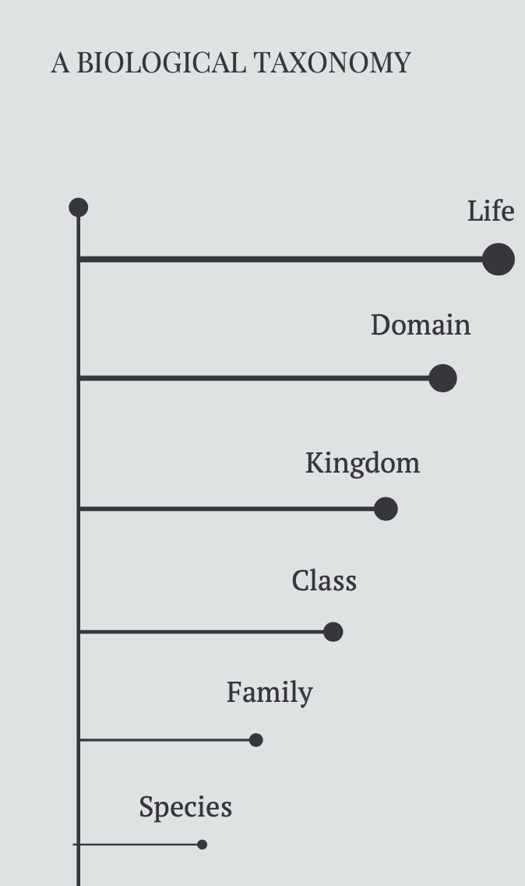
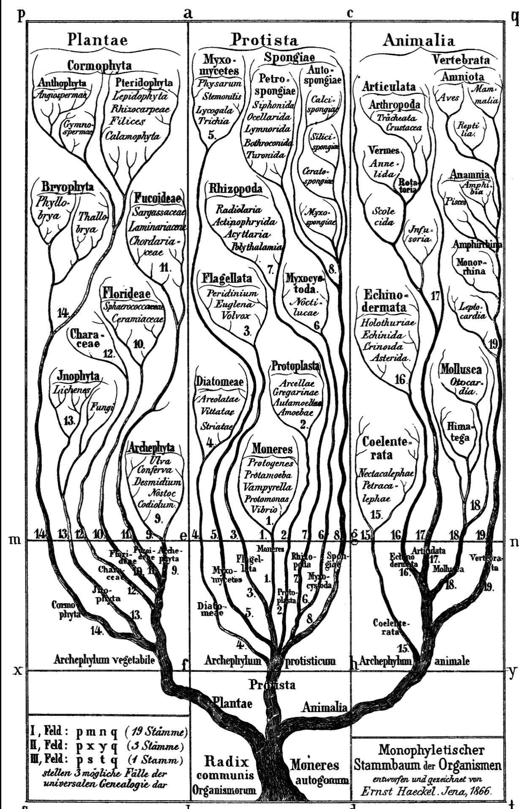
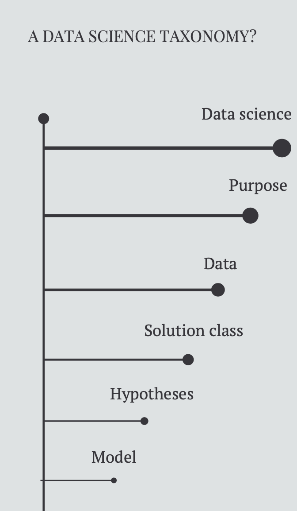
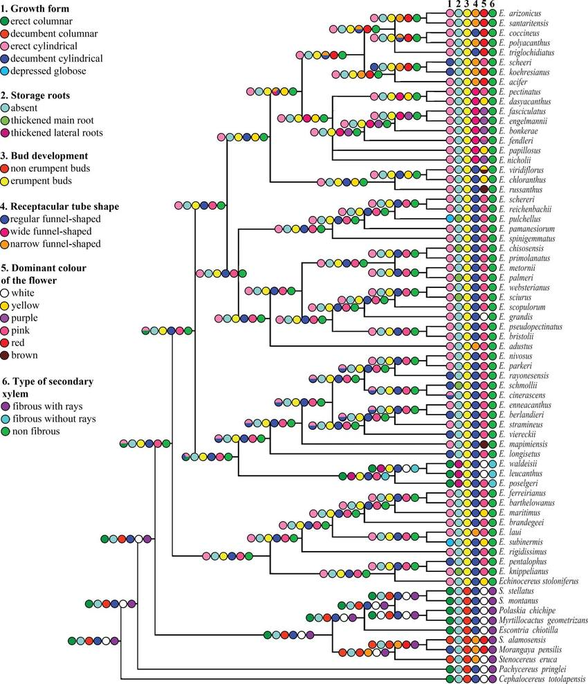

```{r setup, include=FALSE}
knitr::opts_chunk$set(echo = FALSE)
knitr::opts_chunk$set(fig.width = 7, fig.height = 5)
knitr::opts_chunk$set(message=FALSE, warning=FALSE, include=TRUE)
```
# Steph Stammel
Principal Econometrician, Transurban

@stephdesilva

www.steph.ai

## About this talk

- Taxonomies
- Patterns
- Time series

# Effective data science isn't just software

## Agency and literacy {.build}

- Capability with our software of choice gives us _agency_ over our data

- But we also need data literacy

## We are an open source software community {.build}

- We focus on teaching our members _agency_

- Most of our resources are focussed on _how_ not _why_

- We can use our tools to support _literacy_ too

# Taxonomies

## What a taxonomy? {.smaller}



## What can we learn from a taxonomy? {.build}

- Biologists use taxonomies to classify organisms
- A taxonomy is _structure_


- Structure can help identify the unfamiliar

## What could a taxonomy for data science patterns look like? {.smaller}
[Haeckel's 1866 conception of life](https://en.wikipedia.org/wiki/Kingdom_(biology)#/media/File:Haeckel_arbol_bn.png)



## A taxonomy for data science patterns?




## So how does this taxonomy help us? {.build}

- Understand what your purpose is
- Design or describe the data you have
- Identify the class of solutions that work for your purpose/data
- Consider potential hypotheses 
- Then write some code...


## Taxonomies help scientists identify groups of related organisms {.build .smaller}

- It's relatively easy to classify most organisms in a kingdom
- It's harder to classify organisms into species when they all look very similar to the untrained eye

[Image source: Sanchez et al.](https://www.tandfonline.com/doi/full/10.1080/14772000.2017.1343260)


# Common time series patterns ... and how to find them


## Understanding the structure of our data - time series {.build}

- Time series is just one of the data science "kingdoms"
- It has challenges and opportunities
- But ... lots of weird organisms too

## We are an open source software community {.build}

```{r echo = TRUE, eval = TRUE, messages = FALSE, include = TRUE}
library(tsibble)
library(feasts)
library(fable)
library(tsibbledata)
library(tidyverse)
```

## Like biologists, we have tools that can help us classify our data

```{r echo = TRUE, eval = TRUE}
ansett %>% 
  filter(Airports == "SYD-BNE") %>%
    autoplot()
```

## We need ways to observe our data's features

```{r echo = TRUE}
ansett %>% 
  filter(Airports == "SYD-BNE") %>%
    has_gaps()
```

## We need ways to work with imperfection in the wild

```{r echo = TRUE, eval = TRUE}
gapless_ansett <- ansett %>% 
                      filter(Airports == "SYD-BNE") %>%
                      fill_gaps()

has_gaps(gapless_ansett)
```

## We need ways to visualise the features that define our data 

```{r echo = TRUE}
gapless_ansett%>%
      filter(Class == "Business") %>%
      model(STL(Passengers ~ trend(window = Inf)))%>%
      components()%>%
      autoplot()
```
## Related organisms can appear very different
```{r echo = TRUE}

gapless_ansett %>% filter(Class == "First") %>% has_gaps()

gapless_ansett%>%
      filter(Class == "First") %>%
      model(STL(Passengers ~ trend(window = Inf)))%>%
      components()%>%
      autoplot()
```


## There are different tools that show different aspects of our data

```{r echo = TRUE}
gapless_ansett%>%
      filter(Class == "Business") %>%
      ACF() %>%
      autoplot()
```
## But if it's the first time you're classifying...

- You have the tools in your hand (agency)
- But how do we intepret these? (literacy)

We start with a _curated collection_

# Thankyou!

Steph Stammel

@stephstammel

www.steph.ai

